*Aprendiz: Valentina Correa Hoyos*

*Ficha - 3144585*

## Link video de Youtube:
https://youtu.be/2udxC6w8V-E

# Sistema Modular de Gestión de Usuarios

Proyecto integrador para el curso **Python avanzado**.  
Aplicación de consola que permite **registrar, listar y buscar usuarios**, aplicando:

- Entornos virtuales (`venv`)
- Gestión de dependencias (`pip` + `requirements.txt`)
- Variables de entorno (`python-dotenv`)
- Modularización (paquetes y módulos)
- Manejo de excepciones

---

# 1. Creando el entorno virtual

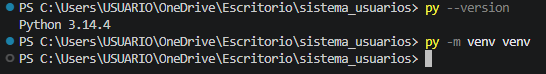

# 2. Activación del entorno

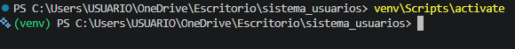

El prompt cambió a (venv) C:\..., lo que indica que ya estoy trabajando dentro del entorno. Todo lo que instale de ahora en adelante quedará aquí, no en el sistema global.

# 3. Instalación de dependencias

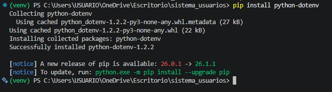

Con el entorno activado, instalé la única dependencia externa:
pip install python-dotenv

La terminal mostró Successfully installed python-dotenv-1.0.0.

Luego generé el archivo requirements.txt:
pip freeze > requirements.txt

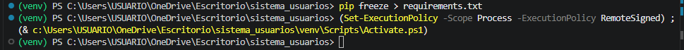

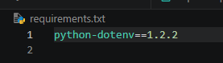

# 4. Variables de entorno

Creé un archivo .env en la raíz con estas variables:

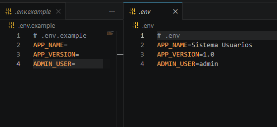

También creé .env.example (con las mismas claves pero sin valores) para subirlo al repositorio.

Luego escribí el módulo settings.py para cargar las variables:

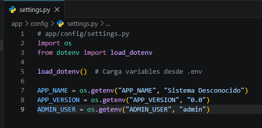

# 5. Estructura modular del proyecto

Organicé el proyecto en paquetes y módulos. Para que Python reconozca las carpetas app, usuarios y config como paquetes, creé dentro de cada una un archivo __init__.py.

- app/__init__.py → vacío (solo marca el paquete).

- app/usuarios/__init__.py → expone las clases principales:

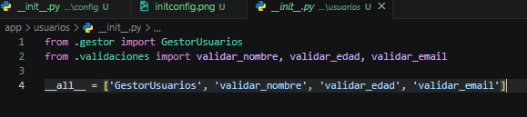

- app/config/__init__.py → exporta las variables de configuración:

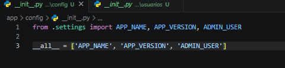

## validaciones.py

El módulo validaciones.py contiene las funciones de validación que lanzan excepciones si los datos son incorrectos.

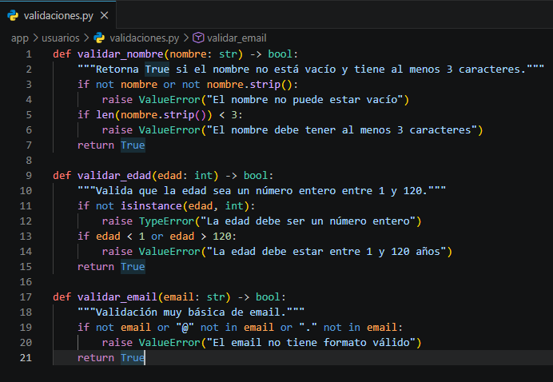

## gestor.py

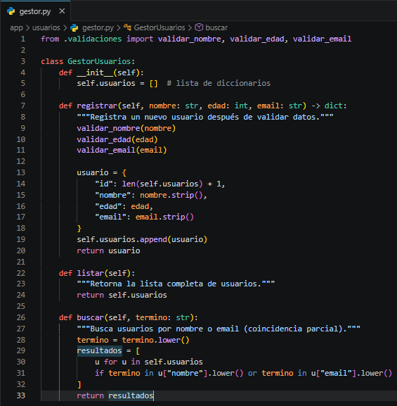

## main.py

El programa principal main.py importa los settings y el gestor, muestra un menú y maneja las excepciones con try/except.

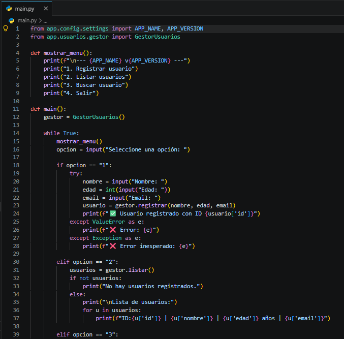

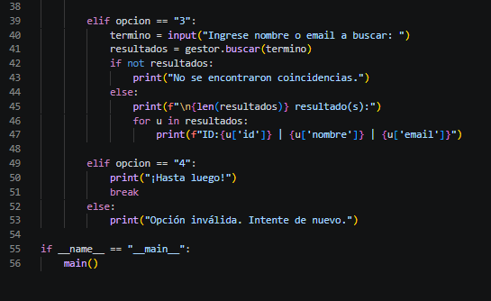

## Menú principal funcionando

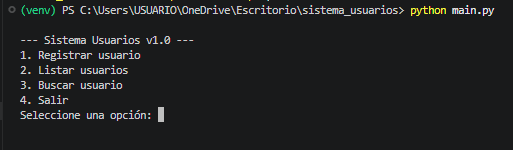

 ## Registrar usuario

 Seleccioné opción 1, ingresé nombre, edad y email válidos. El sistema respondió con ✅ Usuario registrado con ID 1.

 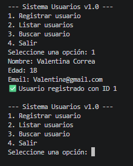

## Validación de errores

Intenté registrar con edad negativa -5. El programa capturó la excepción lanzada por validar_edad y mostró:

❌ Error: La edad debe estar entre 1 y 120 años.

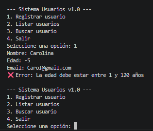

## Listado de usuarios

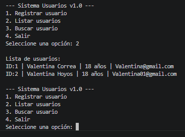

## Buscar usuario

Elegí opción 3, escribí parte de un nombre o email, y el sistema devolvió los resultados coincidentes.

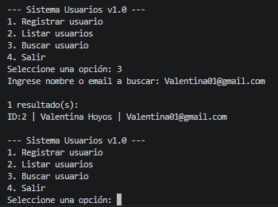
